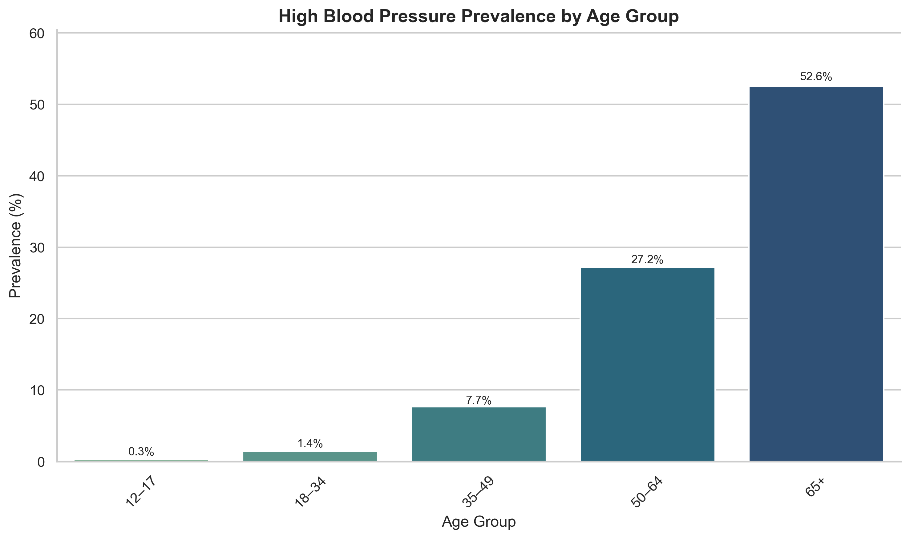
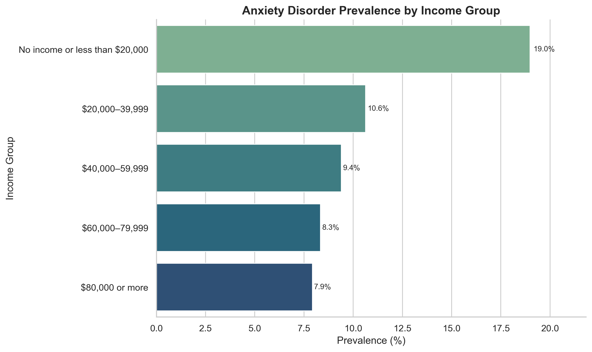

# Chronic Conditions in Canada: An Exploratory Data Analysis

This project presents a comprehensive exploratory analysis of the **Canadian Community Health Survey (CCHS) 2019–20 micro‑data**.  The goal is to uncover patterns in the prevalence of chronic conditions across Canada and to compare the national picture with a detailed case study of Ontario.

## 🔍 What This Project Does

* **Variable extraction and weighting :** The analysis selects only the variables needed to answer the research questions (age, sex, income, province and condition status) and applies survey weights and replicate weights to compute representative prevalence estimates.
* **National EDA :** Summarises the burden of ten chronic conditions, comparing physical vs. mental health, and visualises how prevalence varies by age, sex and income.
* **Ontario deep‑dive :** Compares Ontario’s prevalence rates to the national average and quantifies internal disparities by age and income.
* **Visualization & storytelling :** Produces clear charts and tables that highlight a dual burden—age‑related physical conditions in seniors vs. mental health issues in younger adults—and strong socioeconomic and gender gradients.

## ✨ Key Findings

### National‑level insights

- **Age is the dominant driver:** 83.7 % of seniors (65+) report at least one chronic condition, compared with 19 % of adolescents.
- **Dual health challenge:** Physical conditions (hypertension, diabetes) rise sharply with age, while mental health disorders (anxiety, mood disorders) peak in young adults.
- **Socioeconomic gradient:** Low‑income groups experience nearly twice the prevalence of many conditions compared with high‑income groups.
- **Gender disparities:** Women report higher rates of anxiety, mood and musculoskeletal conditions, whereas men report higher rates of cardiovascular disease.

### Ontario vs. national comparison

- **Physical health:** Ontario’s rates for major physical conditions are at or slightly below the Canadian average.
- **Mental health:** Anxiety and mood disorders are notably more prevalent in Ontario than nationally.
- **Internal disparities matter:** Within Ontario, high blood pressure increases from 0.1 % among adolescents to 52.4 % among seniors, while musculoskeletal conditions affect ~32 % of low‑income groups but only 17 % of high‑income groups.

## 💻 Tools and Methodology

- **Python** with **Pandas** and **NumPy** for data manipulation.
- **Matplotlib** and **Seaborn** for visualisations.
- **Survey weights & bootstrap replicates** to calculate 95 % confidence intervals.
- **Measures of association:** Cramér’s V, absolute differences and relative risks (emphasising practical significance over p‑values).
  
## 🗼 Sample Visualizations

This project produces a full set of condition-by-stratifier plots (e.g., hypertension by age, anxiety by income, diabetes by sex).  
These outputs let you explore how each chronic condition varies across demographic and socioeconomic groups.

Below are two representative examples. For the complete collection, see the [`plots/`](plots) directory, which is organised into:

- `National_Level/` – National prevalence by stratifiers
- `Ontario_Level/` – Ontario-only prevalence by stratifiers
- `Ontario_vs_National/` – Comparative views of Ontario vs. national averages



*High blood pressure prevalence by age group — rising sharply with age.*



*Anxiety disorder prevalence by household income group — illustrating socioeconomic disparities.*

## 📂 Repository Structure

```
CCHS-Chronic-Conditions-EDA/
|
├── Chronic_Conditions_Prevalence_EDA.ipynb   # Main Jupyter Notebook
├── README.md                                 # Project overview (this file)
├── requirements.txt                          # Required Python libraries
├── .gitignore
└── plots/                                    # Visual outputs
    ├── National_Level/
    ├── Ontario_Level/
    └── Ontario_vs_National/
```

## 📟 How to Run

1. Obtain the CCHS 2019–20 micro‑data from [Statistics Canada](https://www.statcan.gc.ca/en) (licensing restrictions prevent distribution of the raw data).
2. Clone this repository:

```bash
git clone https://github.com/arun-data-analyst/CCHS-Chronic-Conditions-EDA.git
cd CCHS-Chronic-Conditions-EDA
```

3. Install the necessary packages:

```bash
pip install -r requirements.txt
```

4. Launch Jupyter and run the analysis:

```bash
jupyter notebook Chronic_Conditions_Prevalence_EDA.ipynb
```

## 👤 Author

**Arun Acharya** – *Data Analyst (Ottawa, Canada)*

---

*If you found this analysis useful, feel free to connect with me on [LinkedIn](https://www.linkedin.com/in/arun-acharya-26077a362) or explore my other projects on [GitHub](https://github.com/arun-data-analyst).*
